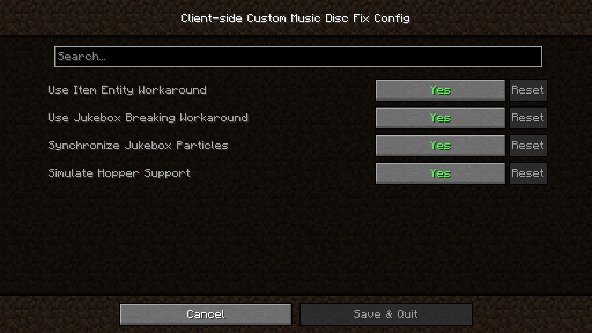

# Client-side Custom Music Disc Fix

A simple client-side mod that fixes [MC-260346](https://bugs.mojang.com/browse/MC-260346) where custom music discs are cut off if they exceed the vanilla length.

## Features
- Play a custom music disc at its full length
- Stop a custom music disc while it is playing
- Simulate hopper support on the client
- Synchronize jukebox particles with the client's music
- Toggle music disc attenuation to listen to music globally

## Dependencies
[Fabric Loader](https://fabricmc.net/) and [Fabric API](https://modrinth.com/mod/fabric-api) are required. If you want to access configurations in-game, you can also install [Cloth Config](https://modrinth.com/mod/cloth-config) and [Mod Menu](https://modrinth.com/mod/modmenu).

## Resource Pack Format
The file name of your music file must be the same as the vanilla disc you are replacing. You can follow this [YouTube video](https://www.youtube.com/watch?v=yVq8O1Ie0hE) or other online sources.

## Technical Information, Configuration Options and Known Issues
Check out the [wiki](https://github.com/Alpha-DS/Client-side-Custom-Music-Disc-Fix/wiki) and [issues](https://github.com/Alpha-DS/Client-side-Custom-Music-Disc-Fix/issues) pages for more info.

## External Links
[Modrinth](https://modrinth.com/project/client-side-custom-music-disc-fix) 
[CurseForge](https://legacy.curseforge.com/minecraft/mc-mods/client-side-custom-music-disc-fix) 
[Ko-fi](https://ko-fi.com/alphads)

If you have any questions or issues, please send an email to `alphadsmrt@gmail.com` (with your Discord username if you prefer).

